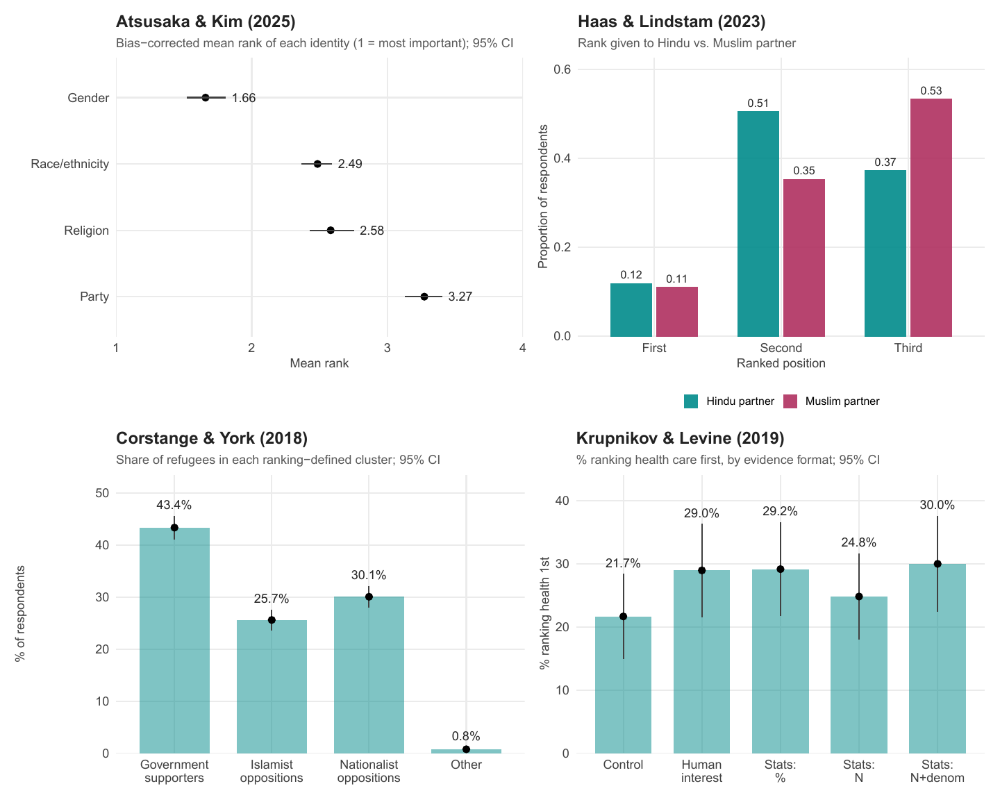

Across scientific disciplines, researchers have used ranking data to study people's comparative judgments, preferences, and decision-making over a range of items. While existing data-sharing infrastructures in statistics and machine learning, such as [PrefLib](https://preflib.github.io/PrefLib-Jekyll/), offer a rich collection of ranking datasets, including those related to politics, they are not necessarily designed specifically to support cumulative research in social science.

To fill this gap, we introduce the first large-scale database of political rankings based on various studies from leading political science journals. Our first release covers 52 datasets from 27 original studies published between 2005 and 2025. Our database demonstrates notable variation in substantive topics and forms of ranking data that go well beyond canonical examples of candidate evaluations and value orientations, enabling researchers to perform comparative analyses, replication, reanalysis, methodological evaluation, and new substantive research with real-world political rankings.

The database of political rankings is developed and maintained by [Yuki Atsusaka](https://atsusaka.org/) and [Shubhangi Singh](https://scholar.google.com/citations?user=Nea56oAAAAAJ&hl=en). For helpful tools to analyze rankings, see also R package:[`rankingQ`](https://sysilviakim.com/rankingQ/).

### Examples

<figure class="replication-findings">



<figcaption>Replications of <a href="https://doi.org/10.1017/pan.2024.33">Atsusaka and Kim (2025)</a>, <a href="https://doi.org/10.1017/S000305542300117X">Haas and Lindstam (2023)</a>, <a href="https://doi.org/10.1111/ajps.12348">Corstange and York (2018)</a>, and <a href="https://doi.org/10.1086/701722">Krupnikov and Levine (2019)</a>.</figcaption>

</figure>

## Download

The complete database is available as a single ZIP file.

[⬇ Download the database (ZIP)](https://github.com/political-rankings/political-rankings.github.io/releases/latest/download/political-rankings.zip)

<p id="database-download-count" class="download-count" aria-live="polite">

</p>

*Note: Some entries for "ranking" may appear as dates or evaluated values depending on the set-up of your Excel tools. However, these are not errors contained in our database.*

## Codebook

The guide to our database is available as a single codebook.

[⬇ Download the codebook (PDF)](https://github.com/political-rankings/political-rankings.github.io/releases/latest/download/codebook.pdf)

<p id="codebook-download-count" class="download-count" aria-live="polite">

</p>

## Manuscript

For the details about the motivation, data collection, and validation, see our associated manuscript.

[⬇ Download the paper (PDF)](https://github.com/political-rankings/political-rankings.github.io/releases/latest/download/atsusaka-singh-2026.pdf)

<p id="manuscript-download-count" class="download-count" aria-live="polite">

</p>

```{=html}
<style>
  .download-count {
    align-items: center;
    color: #495057;
    display: flex;
    flex-wrap: wrap;
    font-size: 0.85em;
    gap: 0.35rem;
  }
  .download-label { font-weight: 600; }
  .download-badge {
    background: #6c757d;
    border-radius: 0.25rem;
    color: #fff;
    display: inline-block;
    font-weight: 600;
    padding: 0.2em 0.55em;
    text-decoration: none;
  }
  a.download-badge:hover, a.download-badge:focus {
    background: #495057;
    color: #fff;
    text-decoration: none;
  }
  .download-badge-total { background: #0171B0; }
</style>
<script>
  document.addEventListener("DOMContentLoaded", function () {
    var databaseCount = document.getElementById("database-download-count");
    var codebookCount = document.getElementById("codebook-download-count");
    var manuscriptCount = document.getElementById("manuscript-download-count");
    var formatNumber = new Intl.NumberFormat();
    var assets = [
      { names: ["political-rankings.zip"], label: "database", element: databaseCount },
      { names: ["codebook.pdf"], label: "codebook", element: codebookCount },
      { names: ["atsusaka-singh-2026.pdf", "atsusaka-singh-2026-political-rankings.pdf"], label: "manuscript", element: manuscriptCount }
    ];

    fetch("https://api.github.com/repos/political-rankings/political-rankings.github.io/releases?per_page=100")
      .then(function (r) { return r.ok ? r.json() : Promise.reject(r.status); })
      .then(function (releases) {
        var published = releases.filter(function (release) { return !release.draft; });

        if (!published.length) {
          assets.forEach(function (asset) {
            asset.element.textContent = "No published releases yet.";
          });
          return;
        }

        assets.forEach(function (asset) {
          var assetTotal = 0;
          var versionCounts = published.map(function (release) {
            var count = (release.assets || []).reduce(function (total, releaseAsset) {
              return total + (asset.names.indexOf(releaseAsset.name) !== -1 ? releaseAsset.download_count : 0);
            }, 0);
            assetTotal += count;
            return "<a class=\"download-badge\" href=\"" + release.html_url + "\">" +
              release.tag_name + ": " + formatNumber.format(count) + "</a>";
          });
          asset.element.innerHTML = "<span class=\"download-label\">Downloads:</span>" +
            versionCounts.join("") + "<span class=\"download-badge download-badge-total\">All versions: " +
            formatNumber.format(assetTotal) + "</span>";
        });
      })
      .catch(function () {
        assets.forEach(function (asset) {
          asset.element.textContent = "Download statistics are temporarily unavailable.";
        });
      });
  });
</script>
```
